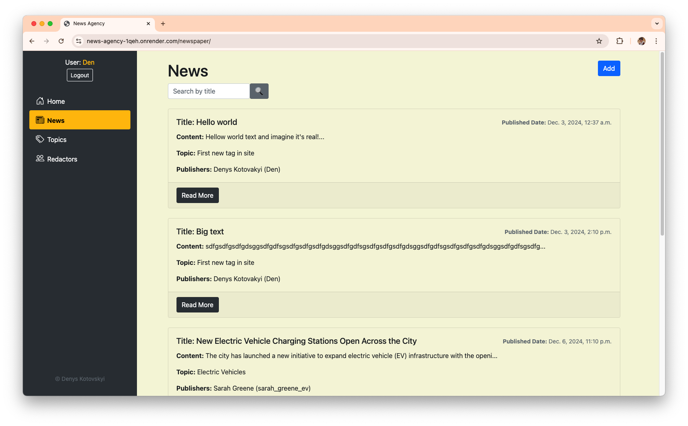

# News Agency Project

Django project for managing newspapers and redactors in News Agency

## Demo

Live demo: [News Agency project deployed to Render](https://news-agency-1qeh.onrender.com)

Test credentials:
* Username: Den
* Password: 1234

## Instalation

Python3 must be already installed

```shell
git clone https://github.com/Den-k0/news-agency
cd news-agency
python3 -m venv venv
source venv/bin/activate
pip install -r requirements.txt
python manage.py runserver  # starts Djagno Server
```

## Features

* Authentication functionality for Redactor/User
* Managing newspapers & redactors directly from website interface
* Powerful admin panel for advanced managing

## Demo


